# Trabajo Final sistemas distribuidos

## Presentado por:

* **Jaime Andrés Pérez Hinestroza: 201903028**
* **Jhonny Cardenas Velasco: 201903306**

Proyecto de despliegue de programa FAAS (Funtion as a service) para la clasificación de números escritos a mano en imágenes de tamaño 8x8 usando las librerias Keras y TensorFlow en el lenguaje python.
El proyecto se desplegó en un kluster local con minikube y la función fue creada y desplegada usando Openfaas, para visualizar la función se uso Inlets y Digital, la estructura del proyecto se puede ver en la siguiente imagen.


IP publica: http://165.22.127.169/ui/

Logearse con la siguiente instrucción:

```
echo -n 9b4fa20ae72fc1fd98e4decad055d8ef7d15c3a8 | faas-cli login -g 'http://165.22.127.169:80' -u admin --password-stdin
```

Ejemplo de ejecucion de la función:

```
echo "`base64 example-images/4.png`" | faas-cli invoke number-detector
```

Ejemplo en asccinema del funcionamiento de la funcion 

[**Ejemplo de ejecucion**](https://asciinema.org/a/XFdHdspKVjjAiMFMdFWCeoLBx)

---
## Prerrequisitos


Para el despliegue funciones se uso [Openfaas](https://github.com/openfaas/faas), proyecto libre creado por Alex Ellis, para la fácil constricción y despliegue de funciones en cluster de kubernets.

La configuración del cluster de kubernets se realizo usando el gestor de paquetes helm que facilitó la instalación de openfaas en minikube

* [**Minikube**](https://kubernetes.io/es/docs/tasks/tools/install-minikube/): El Despliegue del cluster se realizo usando Minikube que permite crear un kluster de kubernets de un único nodo usando contenedores y maquinas virtuales, por lo cual es necesario tener instalado en el equipo algún gestor de maquinas virtuales como [VirtualBox](https://www.virtualbox.org/).

```
curl -Lo minikube https://storage.googleapis.com/minikube/releases/latest/minikube-linux-amd64 && \
chmod +x minikube && \
sudo cp minikube /usr/local/bin && rm minikube
```

* Para el despliegue funciones se uso [Openfaas](https://github.com/openfaas/faas), proyecto libre creado por Alex Ellis, para la fácil constricción y despliegue de funciones en cluster de kubernets. Instalacion faas-cli equipo

```
curl -sL cli.openfaas.com | sudo sh
```

* Instalar helm

```
curl -fsSL -o get_helm.sh https://raw.githubusercontent.com/helm/helm/master/scripts/get-helm-3 && \
chmod 700 get_helm.sh && \
./get_helm.sh
```

---
## Crear Cluster de kubernets usando minikube

Como primer paso del proyecto se creo un cluster usando minikube y el gestor de paquetes helm para la instalación de openfaas en el siguiente enlace se puede observar un vídeo en asccinema de la instalación y configuración del cluster.

* [**ENLACE A VÍDEO EN ASCIINEMA**](https://asciinema.org/a/as4wKH16BBx4yduPeV6uasI7K)

### Iniciar cluster con kubernets

Como paso inicial se crea cluster de minikube con la siguiente instruccion.

```
minikube start
```
Se deberia de ver un resultado similar al siguiente:

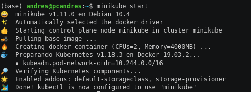

### Crear service account de Helm 

Tras la creación del cluster con minikube es necesario configurar una cuenta de Helm para poder usar los paquetes, esto se puede hacer con la siguiente instrucción.


```
kubectl -n kube-system create sa tiller && kubectl create clusterrolebinding tiller --clusterrole cluster-admin --serviceaccount=kube-system:tiller
```

Se deberia de ver un resultado similar al siguiente:

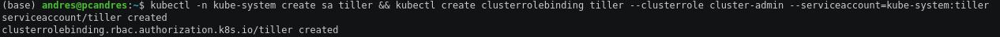

### Crear namespaces 

Se crea los namespaces para los componentes núcleos de Openfaas y las funciones de Openfaas


```
kubectl apply -f https://raw.githubusercontent.com/openfaas/faas-netes/master/namespaces.yml
```
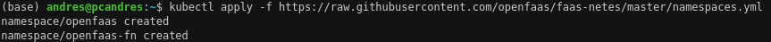

### Añadir openfaas al repositorio de helm

```
helm repo add openfaas https://openfaas.github.io/faas-netes/
```
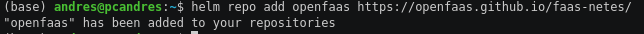

### Actualiza charts de helm

Helm usa un formato de paquetes denominado charts, que describen los set de recursos de kubernets, por lo cual es necesarios actualizarlos para hacer la instalación de Openfaas

```
helm repo update
```

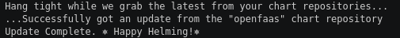

### Genera contraseña valida para cliente openfaas,

```
export PASSWORD=$(head -c 12 /dev/urandom | shasum| cut -d' ' -f1)
```

**Consultar la contraseña con  `echo $PASSWORD`  si se desea utilizar mas adelante**

### Crea usuario para publicar funciones en el Kluster usando la contraseña creada
```
kubectl -n openfaas create secret generic basic-auth --from-literal=basic-auth-user=admin --from-literal=basic-auth-password="$PASSWORD"
```

### Instalar openfaas usando chart

```
helm upgrade openfaas --install openfaas/openfaas --namespace openfaas --set functionNamespace=openfaas-fn --set basic_auth=true
```

Si la instalación se hace de manera correcta debería aparecer un mensaje similar al siguiente

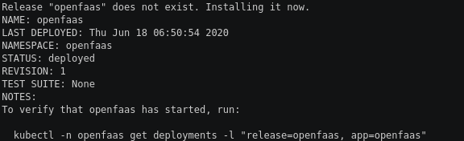

### Asigna url a openfaas

```
export OPENFAAS_URL="http://$(minikube ip):31112"
```

### Opcionalmente se puede guardar la url en las variables de ambiente

```
opfaas="export OPENFAAS_URL=${OPENFAAS_URL}" && \
echo $opfaas >> /home/${USER}/.bashrc
```

### Logearse usando el usuario admin creado

```
echo -n $PASSWORD | faas-cli login -u admin --password-stdin
```

Si hay acceso a al cluster por Faas'cli dberia de mostrar el siguiente mensaje

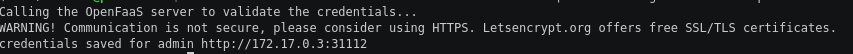

### Se valida la instalación

```
kubectl get pods -n openfaas
faas-cli list
```
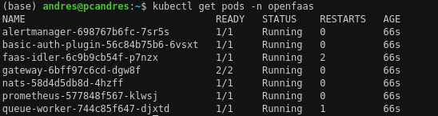


---

## Configuracion de inlets

Descarga imagen creada de docker

```
docker pull jhonnyc2320/inletsjhonny
```

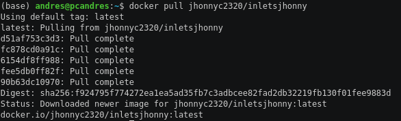

Ejecutar contenedor a partir de la imagen

```
docker run -d -it -e UPSTREAM=$OPENFAAS_URL f6995a19aa99
```
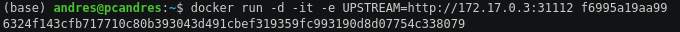

---
## Crea funcion 

### Usar debian 3
Permite usar librerías compiladas como numpy y TensorFlow
```
faas-cli template pull https://github.com/openfaas-incubator/python3-debian
faas-cli new numpy-function --lang python3-debian
```

---
## Funcion tensorflow

La funcion creada para desplegarse en el cluster fue uan red neuonal sencilla de 5 capas usando keras y TensorFlow. La red neuronal se encarga de clasificar imagenes de números escritos a mano en imagenes de resolucion 8x8, el set de entrenamiento usado fue obtenido de la libreria sklearn en la carpeta Código python en [**number-detector**](number-detector) se encuentra el codigo usado.

### Librerias usadas

[**requirements.txt**](number-detector/requirements.txt) 

```
Pillow
numpy
sklearn
tensorflow
```


### Set de entrenamiento

Se usaron 1000 imágenes para entrenar, en la carpeta [**example-images**](example-images) hay 100 imágenes por fuera de las usadas en el entrenamiento para probar la función.

```
digits = datasets.load_digits()

images_and_labels = list(zip(digits.images, digits.target))
X=[]
Y=[]
n=np.prod(images_and_labels[0][0].shape) #dimension in line image
for index, (image, label) in enumerate(images_and_labels[:1000]):    
    _X=np.reshape(image,n) # get image in an array
    X.append(_X) # add array image to list of images
    _Y=np.zeros(10) # create the output of the NN
    _Y[label]=1 # ouput nn for images index
    Y.append(_Y) # add the oputput to the list of ouputs
X=np.vstack(X)
Y=np.vstack(Y
```
### Red neuronal

Con queras se creo una red neuronal sencilla con una topología [64,16,32,16,10], con una medida de error se error cuadrático medio y usando el algoritmo Adam para la retropropagación.

```
topology=[n,16,32,16,10]

model = kr.Sequential()

# Añadimos la capa 1
model.add(tf.keras.layers.Flatten())

# Añadimos la capa 2
model.add(kr.layers.Dense(topology[1], activation='relu'))

# Añadimos la capa 3
model.add(kr.layers.Dense(topology[2], activation='relu'))

# Añadimos la capa 4
model.add(kr.layers.Dense(topology[3], activation='relu'))

# Añadimos la capa 5
model.add(kr.layers.Dense(topology[4], activation='sigmoid'))

# Compilamos el modelo, definiendo la función de coste y el optimizador.
model.compile(loss='mse', optimizer='adam', metrics=['acc'])

# Y entrenamos al modelo. Los callbacks 
model.fit(X, Y, epochs=100, verbose=0)

model.save('num_detector.model')
```

### Enviar imagenes

Para enviar imágenes por Openfaas, se codifico las imágenes en base64 y se envío como string a la función, tras esto se decodifico nuevamente y se guardo la información en una imagen dentro del contenedor la cual es cargada y enviada a la red neuronal entrenada

```
binary = os.fsencode(req)
        

image_64_decode = base64.decodebytes(binary) 

result_file = 'image'
with open(result_file, 'wb') as file_handler:
    file_handler.write(image_64_decode)

Image.open(result_file).save(result_file + '.png', 'PNG')
os.remove(result_file)

image = Image.open(result_file + '.png')

image = np.asarray(image)
input_image=np.array([np.reshape(image,np.prod(image.shape)),])

res = get_number(input_image)

print('La imagen tiene el numero: ',res)
```

### Obtener numero imagen

Para Obtener el numero de la imagen se ingresa la imagen cargada a la función al modelo ya entrenado.

```
try:
    model = tf.keras.models.load_model('num_detector.model')
except :
    train()
    print('Modelo entrenado')
    model = tf.keras.models.load_model('num_detector.model')

Yr = model.predict(input_image)
res = np.argmax(Yr[0])

return res   
```

---
## Construye, publica y despliega funcion
```
for i in build push deploy ; do
    faas-cli ${i} -f ./number-detector.yml
done
```
---
## Ejecutar funcion

Para enviar imágenes es necesario codificar las imágenes en base 64 y enviarlas a la función con el comando `base64 image.png`

```
echo "`base64 example-images/1.png`" | faas-cli invoke number-detector
```


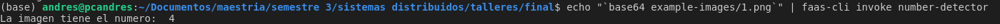

[**Ejemplo de ejecucion**](https://asciinema.org/a/XFdHdspKVjjAiMFMdFWCeoLBx)